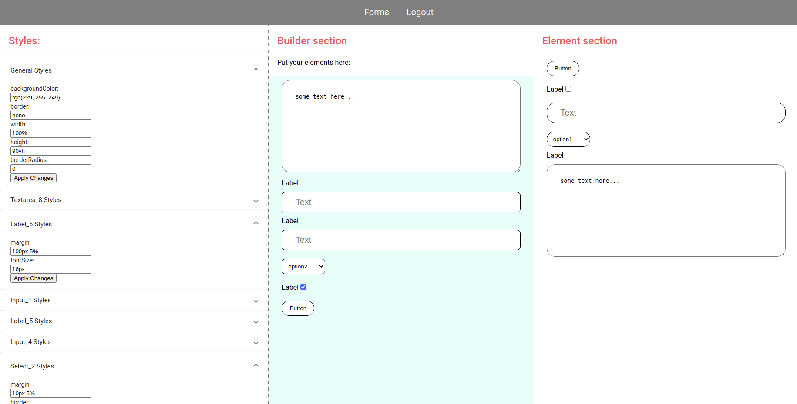

# Formbuilder

## Overview

This project is an app for building beautiful forms by dragging default elements from Elements section to Builder section and then customizing them in Styles section (two elements of the same type  can be customised in two different ways).

**Technologies:** Angular, Angular Material CDK, NgRX, RxJS, Json-server.

This project was generated with [Angular CLI](https://github.com/angular/angular-cli) version 11.2.6.

## Development server

Run `ng serve` for a dev server. Navigate to `http://localhost:4200/`. The app will automatically reload if you change any of the source files.

